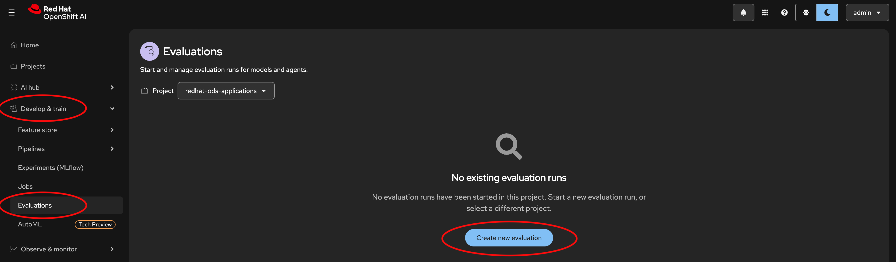

## Deploying Evalhub

Evalhub is bundled in with RHOAI and provides the CRD `LMEvalJob`, that will ultimately be used to run the eval against the model.

### Steps

1) Ensure that `trustyai` is managed in the DataScienceCluster CR. You should also ensure MLFlow is enabled.

```yaml
apiVersion: datasciencecluster.opendatahub.io/v2
kind: DataScienceCluster
...
spec:
  components:
    ...
    trustyai:
      eval:
        lmeval: {}
          permitCodeExecution: allow
          permitOnline: allow
      managementState: Managed
      mcpGuardrailsMode: false
    ...
    mlflowoperator:
      managementState: Managed
    
```
2) Ensure `disableLMEval: false` is in the `OdhDashboardConfig` CR.

```yaml
apiVersion: opendatahub.io/v1alpha
kind: OdhDashboardConfig
...
spec:
  dashboardConfig:
    ...
    disableLMEval: false
```

3) Apply the MLFlow CR.

```bash
oc apply -f deploy/mlflow.yaml
```

4) Deploy postgreSQL into the `redhat-ods-applications` namespace. Ensure you change the postgresql user and password.

```bash
# Example for MacOS
sed -ie "s,\<user\>,CHANGE_ME,g" deploy/postgresql.yaml
sed -ie "s,\<password\>,CHANGE_ME,g" deploy/postgresql.yaml

oc apply -f deploy/postgresql.yaml
```

5) Apply the Evalhub CR

```bash
oc apply -f deploy/evalhub-cr.yaml
```

6) To verify Evalhub's installation, you can check the pods:

```bash
oc get pods -n redhat-ods-applications | grep evalhub

evalhub-5b498bbdcb-jzdqq                         1/1     Running   0               7m43s
evalhub-postgres-7cb96f4bb4-pz7gc                1/1     Running   0               9m54s
```

And the Red Hat OpenShift AI UI will give you the option to create an evaluation at **Develop & Train --> Evaluations**

